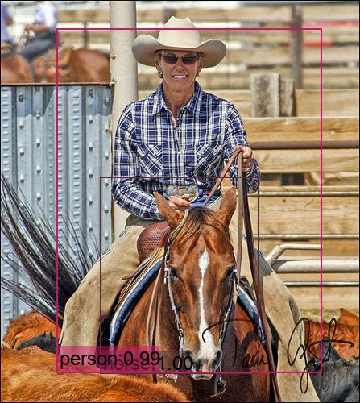

# SSD-Pytorch 

SSD目标检测算法(Single Shot MultiBox Detector)(简单,明了,易用,中文注释)

(If you train the model on a single computer and mutil GPU, this program will be your best choice , easier to use and easier to understand)

模型.训练.检测等流程全部面向对象实现,简单易用.

全中文备注,详细说明每一步步骤.

欢迎
[](https://github.com/yatengLG/SSD-Pytorch/stargazers) 
[](https://github.com/yatengLG/SSD-Pytorch/network)



***
## 特点
相较于其他SSD项目,本项目在模型实现上更为合理.多GPU调用方面更加简单灵活.

将[基础网络,额外层]合并,利于替换基础网络,也便于改变网络连接情况,将[Conf分类网络和loc回归网络]单独出来作为整体,也便于修改增删,至此便是全部的模型构架,输出的是分类网络和回归网络的结果.这种架构使得模型的输出不论是在多GPU还是单GPU环境中输出保持了一致,在多GPU训练扩展时优势尤为显著,避免了很多扩展上的麻烦.

并在模型中预留了检测图片以及检测视频的方法.在初始化模型,载入权重后,便可直接调用进行检测.避免了多次重复编写的以及调用的麻烦.

将[后处理]单独作为一个结构,便于在测试以及检测过程中使用,既方便又便捷,也便于其他项目进行扩展使用.

将[损失函数]以及训练过程写入[训练器]中,不论在结构合理性还是使用合理性方面都更为合适.

[训练器]中集成了训练所需的全部操作,[损失函数],[优化器],[学习率衰减]等,并将由于本项目[数据载入器]分为训练以及测试俩种,故而也加入了训练器中.使得训练器一次配置,多次使用,通过预留的接口,在不失方便的同时保留了灵活性.设置好训练器参数后,只需传入 模型以及数据集 即可完成训练,并将训练过程实时的通过visdom可视化出来.

[测试器]同[训练器]

本项目各部分均可极少修改后用于其他目标检测项目.

由于工作原因,后续会不定时更新,添加摄像头检测以及配置更多的基础网络
***
**本项目单机多卡,通过torch.nn.DataParallel实现,将单机环境统一包装.支持单机单卡,单机多卡,指定gpu训练及测试,但不支持多机多卡和cpu训练和测试.
不限定检测时的设备(cpu,gpu均可).**

```text
本项目所有相关参数均已通过Configs文件进行了配置,且均有详细中文注释;如需指定,备份一份,重新修改即可.
只需要在Configs 中修改_C.DEVICE.TRAIN_DEVICES gpu编号即可实现使用不同gpu进行训练及测试.
或在trainer 中传入train_devices参数 进行gpu指定.

对模型,训练,测试,检测,数据集,数据载入 等均进行了封装,在不降低灵活性的同时,使结构更为清晰明了,对模型的训练等操作也更为易用.

模型方面,将[基础网络,额外层]合并为一体,将[分类网络和回归网络]合并为一体,损失函数
数据集方面,只需修改Configs配置文件中的数据集根目录即可顺利训练自己的数据(目前只支持VOC格式)

数据载入方面,Our_Dataloader 接近于一个无限数据载入,只需循环,即可从数据集中无限循环的取出数据.不占内存,不用计算,按需取出.

另本项目训练器,测试器 等均有良好的适用性,在其他项目中可以直接使用.(训练器,测试器中,调用了数据载入器)

代码中均有详细中文备注,较好理解

```

## 项目结构

| 文件夹| 文件 |说明 |
|:-------:|:-------:|:------:|
| **Data** | 数据相关 |
| | Dataloader| 数据加载器类'Our_Dataloader', 'Our_Dataloader_test'|
| | Dataset_VOC|VOC格式数据集类|
| | Transfroms|数据Transfroms|
| | Transfroms_tuils|Transfroms子方法|
| **Model**| 模型相关|
| | base_models/VGG|现只有vgg模型,后期会更新其他模型|
| | structs/Anchors|默认检测框生成器|
| | structs/MutiBoxLoss|SSD损失函数|
| | structs/PostProcess|后处理|
| | structs/Predictor|分类及回归网络|
| | evaler |验证器,用于在数据集上对模型进行验证(测试),计算ap,map |
| | ssd_model|SSD模型类 |
| | trainer|训练器,用于在数据集上训练模型 |
| **Utils**|各种工具|
| |boxs_op |各种框体操作,编码解码,IOU计算,框体格式转换等|
| **Weights**| 模型权重存放处|
| | pretrained|预训练模型权重存放处|
| | trained |训练过程中默认模型存放处|
| ---- | Configs.py|配置文件,包含了模型定义,数据以及训练过程,测试过程等的全部参数,建议备份一份再进行修改|
| ---- | Demo_train.py| 模型训练的例子,训练过程中的模型会保存在Weights/Our/ |
| ---- | Demo_eval.py| 模型测试的例子,计算模型ap,map |
| ---- | Demo_detect_one_image.py|检测单张图片例子|
| ---- | Demo_detect_video.py|视频检测例子,传入一个视频,进行检测|

| 预训练模型权重| |下载后存放于Weight/pretrained/下 | |
|:-------:|:-------:|:------:|:------:|
|ssd300_vgg预训练模型|vgg_ssd300_voc0712.pkl|百度网盘链接: https://pan.baidu.com/s/1BxrH5oqmD7Nj3ORfSka00Q|提取码:k1b2
|vgg预训练模型|vgg16_reducedfc.pth|百度网盘链接:https://pan.baidu.com/s/1BPqFeo0FtKZVrqM7Y-c6Vg|提取码:24se

# Requirements


1. pytorch
2. opencv-python
3. torchvision >= 0.3.0
4. [Vizer](https://github.com/lufficc/Vizer) (在代码实现上也借鉴了lufficc大神的一些思想)
5. visdom


# Demo例子
本项目Demo均是完整的训练,测试,检测过程,可直接运行.
## Train训练
本项目采用visdom进行训练过程可视化.

visdom安装 及运行:
```visdom安装
pip install visdom   安装
python -m visdom.server     运行

打开网页`127.0.0.1:8097` 进行训练过程可视化
```
**训练器支持单机单卡,单机多卡训练,不支持多机多卡以及cpu.**

训练例子:
```python
    # 实例化模型. 模型的具体各种参数在Config文件中进行配置
    net = SSD(cfg)
    # 将模型移动到gpu上,cfg.DEVICE.MAINDEVICE定义了模型所使用的主GPU
    # 模型的参数更新会在主GPU上进行.
    net.to(cfg.DEVICE.MAINDEVICE)

    # 初始化训练器,训练器参数已通过cfg进行配置;也可传入参数进行配置,但不建议
    trainer = Trainer(cfg, max_iter=None, batch_size=None, 
                      train_devices=None, model_save_step=None, 
                      model_save_root=None, vis = None, vis_step=None)
    # 训练器开始在 数据集上训练模型
    trainer(net, train_dataset)
```


## Eval测试
**对模型进行测试,测试器支持单机单卡,单机多卡测试,但不支持多机多卡,cpu.**
 
测试例子:
```python
    net = SSD(cfg)
    # 将模型移动到gpu上,cfg.DEVICE.MAINDEVICE定义了模型所使用的主GPU
    net.to(cfg.DEVICE.MAINDEVICE)
    # 模型从权重文件中加载权重
    net.load_pretrained_weight('Weights/pretrained/vgg_ssd300_voc0712.pkl')
    # 初始化验证器,验证器参数通过cfg进行配置;也可传入参数进行配置,但不建议
    evaler = Evaler(cfg, eval_devices=None)
    # 验证器开始在数据集上验证模型
    ap, map = evaler(model=net,
                     test_dataset=test_dataset)
    print(ap)
    print(map)
```

## Detect检测
**检测过程本项目给出俩个例子,分别为单张图片检测与视频检测**

单张图片检测,通过调用模型Detect_single_img方法实现.支持gpu与cpu,依模型运行环境而定.
```python
    # 实例化模型
    net = SSD(cfg)
    # 使用cpu或gpu
    net.to('cuda')
    # 模型从权重文件中加载权重
    net.load_pretrained_weight('Weights/pretrained/vgg_ssd300_voc0712.pkl')
    # 打开图片
    image = Image.open("Images/000133.jpg")
    # 进行检测, 分别返回 绘制了检测框的图片数据/回归框/标签/分数.
    drawn_image, boxes, labels, scores = net.Detect_single_img(image=image,score_threshold=0.5)
    
    plt.imshow(drawn_image)
    plt.show()
```

视频检测
```python
    # 实例化模型
    net = SSD(cfg)
    # 使用cpu或gpu
    net.to('cuda')
    # 模型从权重文件中加载权重
    net.load_pretrained_weight('Weights/pretrained/vgg_ssd300_voc0712.pkl')
    
    video_path = 'aaa.mp4'  # 现在忙于其他事,项目后期会上传视频检测样例
    
    # 进行检测,
    # save_video_path=None,则不保存视频; save_video_path=bbb.mp4 将检测后视频保存为bbb.mp4
    # show=True,实时显示检测结果
    net.Detect_video(video_path=video_path, score_threshold=0.02, save_video_path=None, show=True)
```
目前完美支持ssd_300_vgg;ssd_512_vgg有基础网络,但没有添加对应的Config配置文件.
后续会支持更多的网络以及其他功能,敬请期待.


